  

## 📌 About Me
- 🧑‍💻 I'm Chandan Kumar — Frontend Developer
- ⚛️ React · Three.js · GSAP · JavaScript · jQuery
- 🖌️ HTML · CSS · Bootstrap · Tailwind · Sass
- 🔥 Crafting fast, animated & visually stunning web experiences
- 🧠 Obsessed with pushing frontend boundaries
- 🚀 Always up for bold, creative collaborations
- 💌 Let's build something great together!

## 🧠 My Focus Areas
- 🎯 Pixel-perfect, responsive UI development
- 🎞️ Smooth, high-performance animations with GSAP
- 🌌 Immersive 3D web experiences via Three.js
- ⚡ Scalable, dynamic web apps with React
- 📐 Mobile-first & cross-browser design
- 🧵 Clean, maintainable CSS architecture with Sass
- 🏎️ Performance optimization & fast-loading interfaces
- 🧩 Reusable, component-based UI systems

## 📊 GitHub Stats & Trophies

  
  

  

  

  

## 🛠️ Languages & Tools

<h3 align="center">Programming Languages</h3>

  

<h3 align="center">Frontend</h3>

  &nbsp;&nbsp;
  &nbsp;&nbsp;
  &nbsp;&nbsp;
  &nbsp;&nbsp;
  

<h3 align="center">Tools</h3>

  &nbsp;&nbsp;
  &nbsp;&nbsp;
  

  

 

## 🔗 Connect with Me

  &nbsp;&nbsp;
  &nbsp;&nbsp;
  &nbsp;&nbsp;
  &nbsp;&nbsp;
  

  

